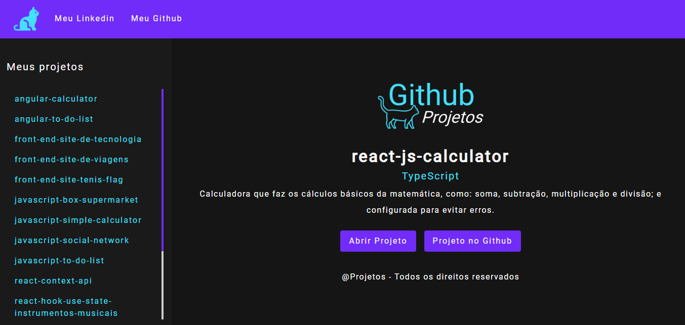
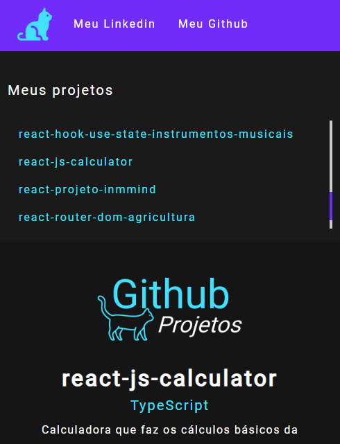

# **Projetos Github**

## Sobre o projeto

Clique e acesse o projeto: [projetos-github-react](https://react-projetos-github.vercel.app/)

Trabalho realizado com o framework React Js, com uso de Typescript, HTML5, CSS3 e Bootstrap. 

Trabalho realizado com o uso da API do Github que acessa o repositório e faz a listagens dos projetos existentes. Com layout resposivo feito com o framework Bootstrap e flexbox.

Trabalhei com componentes de cabeçalho, de rodapé e de conteúdo; dividindo as responsabilidades.

 

Work carried out with the React Js framework, using Typescript, HTML5, CSS3 and Bootstrap.

Work carried out using the Github API that accesses the repository and lists existing projects there. With responsive layout made with the Bootstrap framework and flexbox.

I worked with header, footer and content components; dividing responsibilities.

## Layout Mobile

## Tecnologias Utilizadas

* HTML5
* CSS3
* Flexbox
* Bootstrap 4
* API Github
* Typescript
* React Js

## Instalação

##### Instalar Dependências
<pre><code>npm install</code></pre>

##### Executar Aplicação
<pre><code>npm run dev</code></pre>

## Autor

#### **Katarine Albuquerque**

    
    &nbsp;
    

